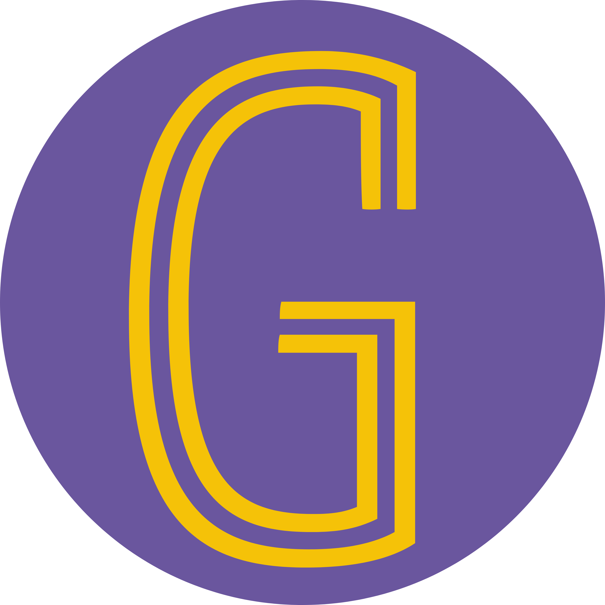
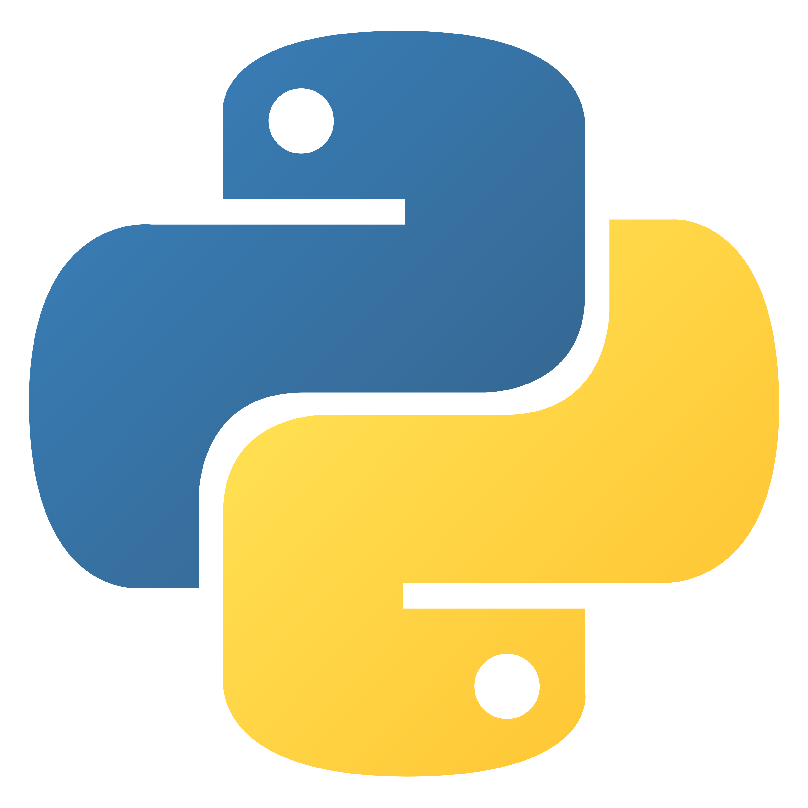
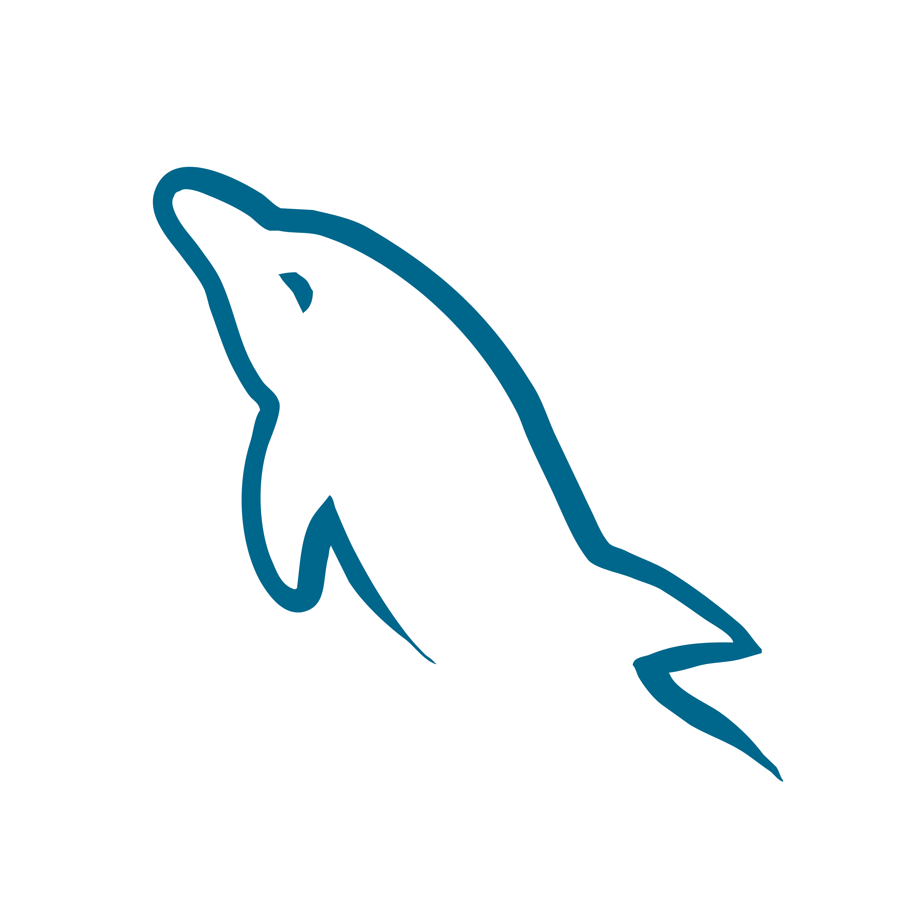

<h1 align="center">Hi 👋, I'm Aditi Gurjar</h1>
<h3 align="center">🌐 Web Developer | ⚡ Java Enthusiast | 🤝 Social-Tech Innovator</h3>

  
  
  

---

### 🔍 About Me

🎓 **B.Tech Graduate** in Computer Science and Engineering – Acropolis Institute of Technology and Research  
💡 Passionate about building meaningful tech that creates social impact  
🔧 Skilled in full-stack development using Java Spring Boot

---

### 🚀 Projects

<table>
  <tr>
    <td align="center" width="300" style="padding: 10px;">
      
      <h3>Giftible.in</h3>
      
An eCommerce platform connecting NGOs with buyers to sell charity-based products.

      <strong>Stack:</strong> FastAPI, React, MySQL, Razorpay, Twilio 
      
    </td>

 
    <td align="center" width="300" style="padding: 10px;">
      
      <h3>SABLE</h3>
      
Online shop for specially abled artisans with translation and payment integration.

      <strong>Stack:</strong> HTML, CSS, JS, Bootstrap, MySQL, Razorpay 
      
    </td>
    <td align="center" width="300" style="padding: 10px;">
      
      <h3>Doctoo</h3>
      
Clinic management system to digitize prescriptions with multilingual support.

      <strong>Stack:</strong> HTML, CSS, JS, Razorpay, OTP Auth, Captcha 
      
    </td>
  </tr>
</table>

---

### 🛠️ Tech Stack

  
  
  
  
  
  
  
  
  
  
  
  

---

### 📊 GitHub Stats

  
  

---

### ✨ Fun Facts

- 📸 I love photography "especially nature and outdoor scenes"  
- 🏔️ I dream of building a peaceful retreat in Mcleodganj  
- 📝 I write journals and poems in my free time  

 

> _“I believe in building technology that empowers people and drives social good.”_

