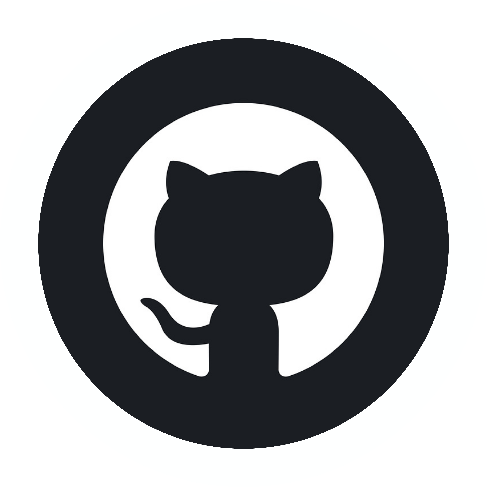
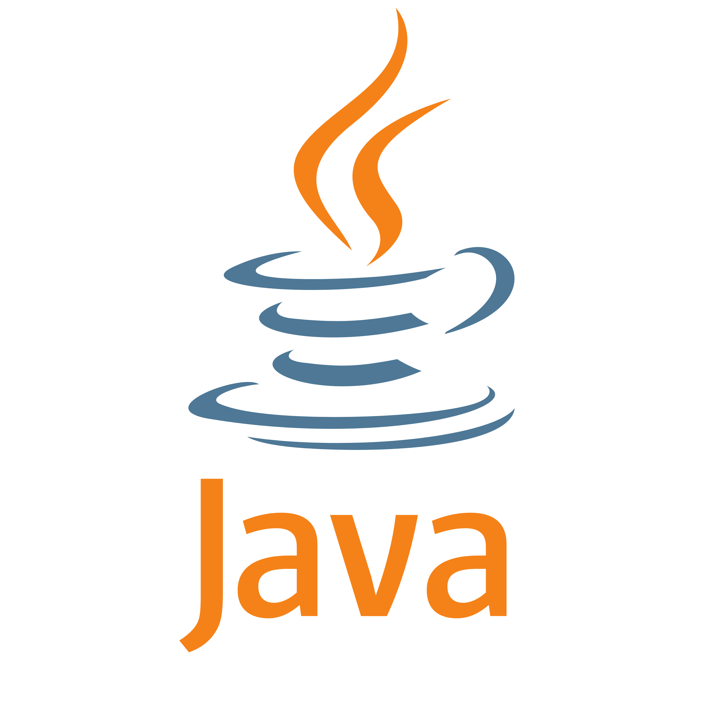
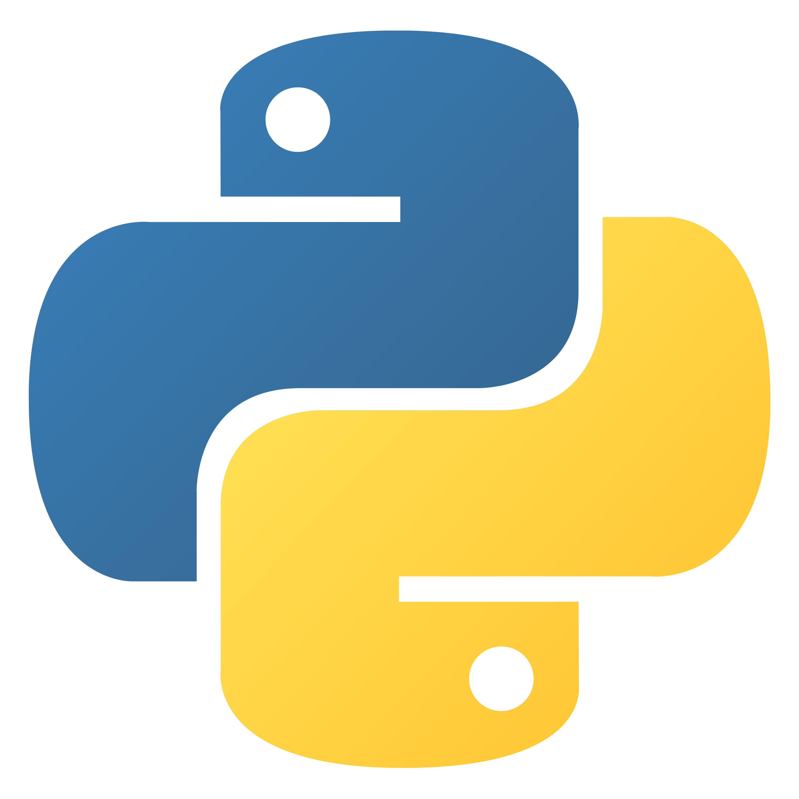
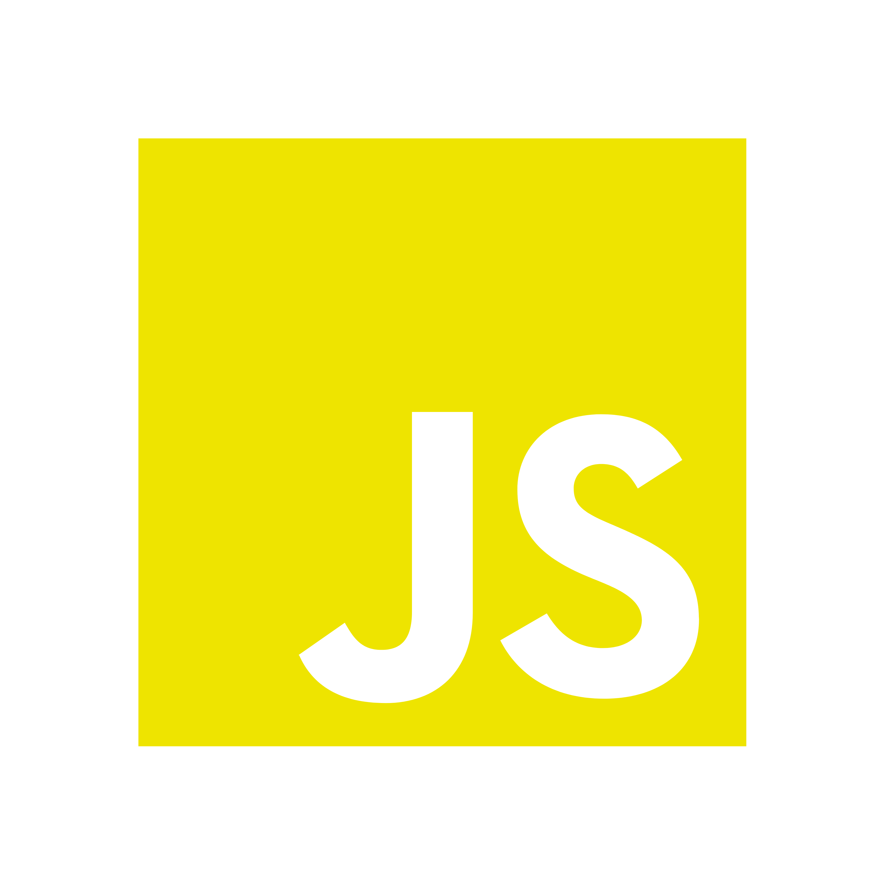
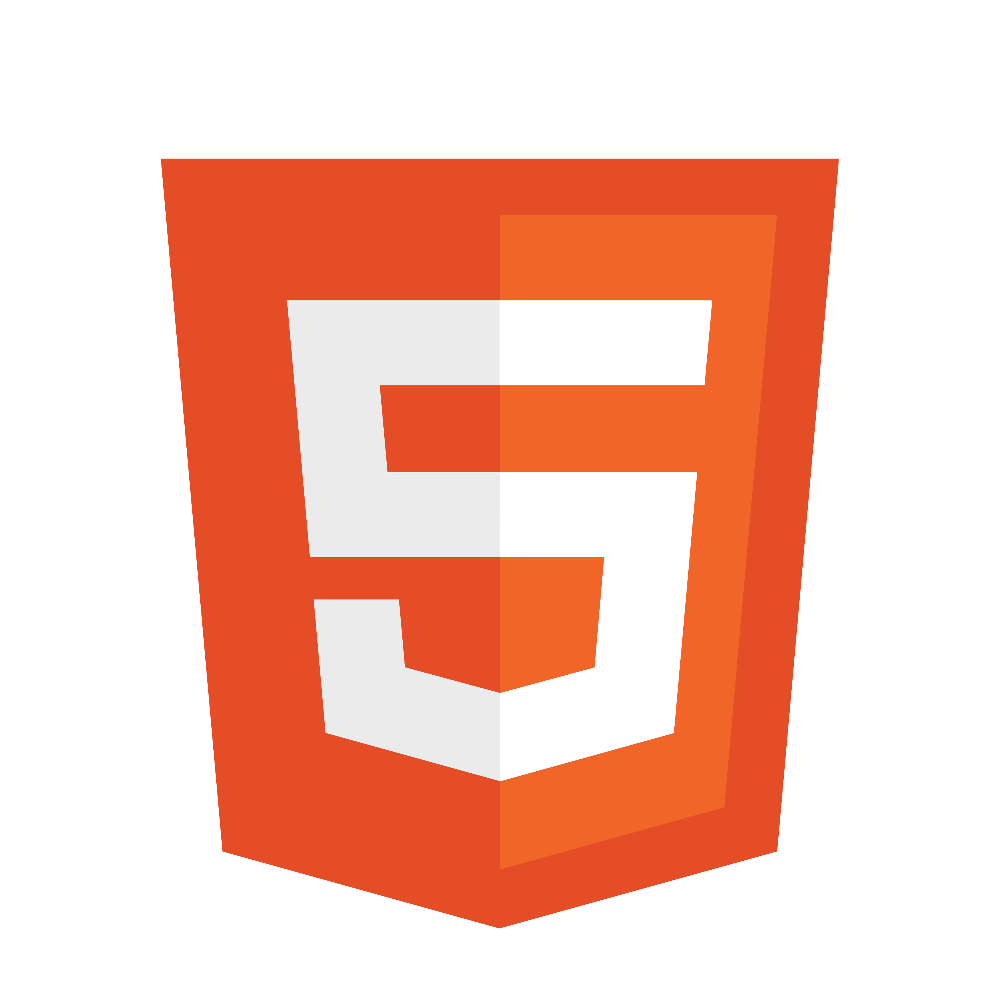
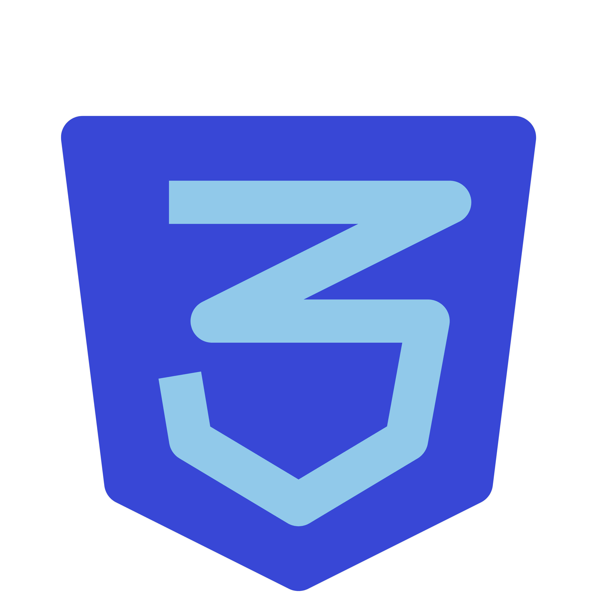
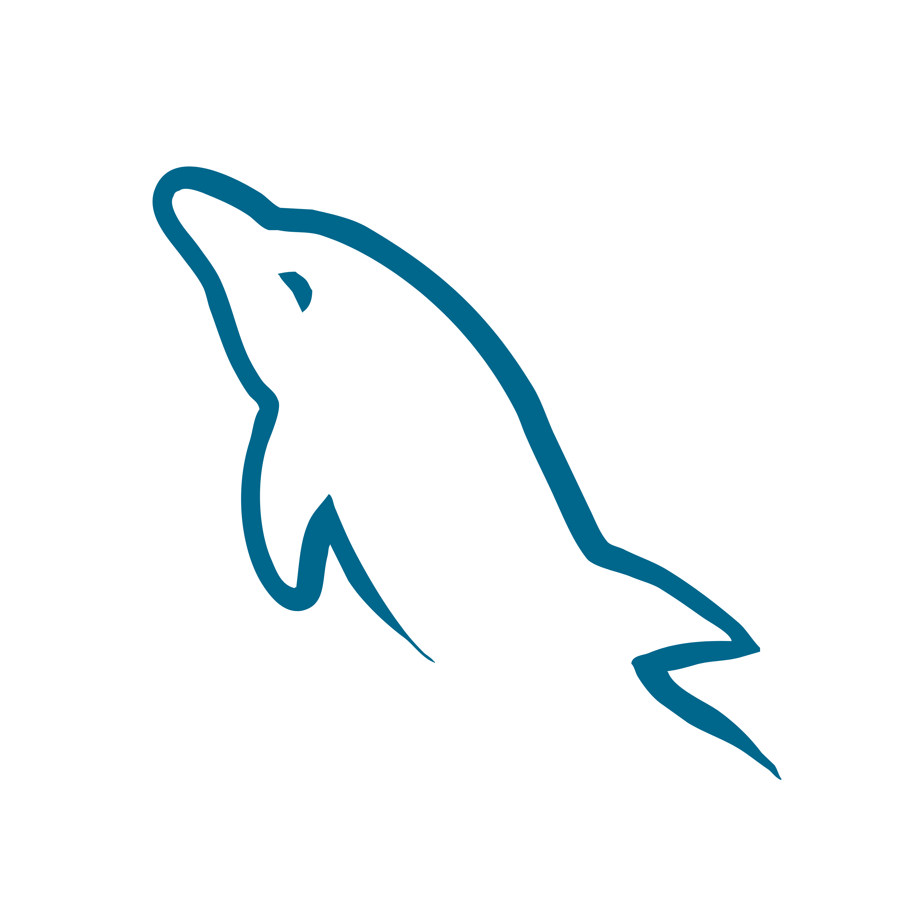
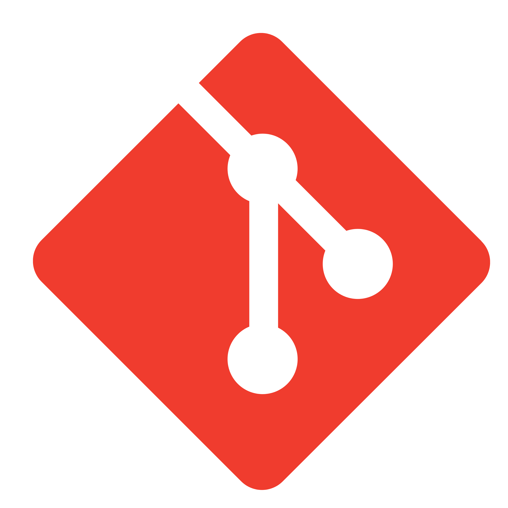

<h1 align="center">Hi 👋, I'm Aditi Gurjar</h1>
<h3 align="center">🌐 Web Developer | ⚡ Java Enthusiast | 🤝 Social-Tech Innovator</h3>

  
  
  

---

### 🔍 About Me

🎓 **B.Tech Graduate** in Computer Science and Engineering – Acropolis Institute of Technology and Research  
💡 Passionate about building meaningful tech that creates social impact  
🔧 Skilled in full-stack development using Java Spring Boot

### 💼 Experience

**Software Design Engineer**  
**Prashuk Infotech Venture**

- 💻 Worked on software development and application implementation. 
- 🛠️ Developed, tested, and debugged software features. 
- 🤝 Collaborated with the team to implement project requirements.

---
### 📚 Currently Learning

- ☕ Advanced Java & Object-Oriented Programming 
- 🌱 Spring Boot & Spring Security 
- 🗄️ SQL & Database Management 
- 🧩 Data Structures & Algorithms 
- 🔗 REST APIs & Backend Development 

### 🚀 Projects

<table>
  <tr>

    <!-- PORTFOLYX -->
    <td align="center" width="300" style="padding: 15px;">
      
      <h3>PORTFOLYX</h3>
      
Web-based portfolio management platform for students to create and manage professional portfolios.

      <strong>Stack:</strong> Java, Spring Boot, Spring Security, JSP, MySQL
        
      
       
      <a href="https://github.com/aditigurjjar/PORTFOLYX">View Repository</a>
    </td>

    <!-- PROJECT 2 -->
    <td align="center" width="300" style="padding: 15px;">
      
      <h3>Smart Contact Manager</h3>
      
Contact management application with secure authentication and user-friendly contact management features.

      <strong>Stack:</strong> Java, Spring Boot, Spring Security, Thymeleaf, MySQL
        
      
       
      <a href="https://github.com/aditigurjjar/Smart-Contact-Manager">View Repository</a>
    </td>

    <!-- PROJECT 3 -->
    <td align="center" width="300" style="padding: 15px;">
      
      <h3>Job Portal</h3>
      
Web-based job portal for connecting job seekers with employers and managing job opportunities.

      <strong>Stack:</strong> Java, JSP, Servlets, MySQL
        
      
       
      <a href="https://github.com/aditigurjjar/Job-Portal">View Repository</a>
    </td>

  </tr>
</table>

---

### 🛠️ Tech Stack

  
  
  
  
  
  
  
  
  
  
  
  

### ✨ Fun Facts

🎨 I enjoy drawing and painting, especially creating creative artwork in my free time. 
✂️ I love crafting and making handmade things, which helps me stay creative and patient. 
🖌️ I enjoy exploring different art styles and experimenting with colors and designs.

 

> _“I believe in building technology that empowers people and drives social good.”_

